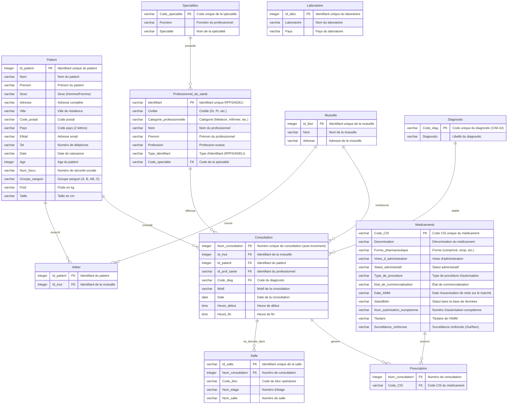

# Modèle Conceptuel de Données (MCD) - Base Healthcare Data

## Diagramme ER en Mermaid

## Description des Relations

### Relations Principales

1. **Patient - Consultation** (1,N)
   - Un patient peut avoir plusieurs consultations
   - Une consultation concerne un seul patient

2. **Professionnel_de_sante - Consultation** (1,N)
   - Un professionnel de santé peut effectuer plusieurs consultations
   - Une consultation est effectuée par un seul professionnel

3. **Specialites - Professionnel_de_sante** (1,N)
   - Une spécialité peut être exercée par plusieurs professionnels
   - Un professionnel possède une spécialité

4. **Diagnostic - Consultation** (1,N)
   - Un diagnostic peut être établi lors de plusieurs consultations
   - Une consultation établit un diagnostic

5. **Mutuelle - Consultation** (1,N)
   - Une mutuelle peut rembourser plusieurs consultations
   - Une consultation est remboursée par une mutuelle

6. **Patient - Adher - Mutuelle** (N,M)
   - Table d'association pour la relation plusieurs-à-plusieurs
   - Un patient peut avoir plusieurs mutuelles
   - Une mutuelle peut couvrir plusieurs patients

7. **Consultation - Prescription - Medicaments** (N,M)
   - Table d'association pour les prescriptions
   - Une consultation peut générer plusieurs prescriptions de médicaments
   - Un médicament peut être prescrit lors de plusieurs consultations

8. **Consultation - Salle** (1,N)
   - Une consultation se déroule dans une salle
   - Une salle peut accueillir plusieurs consultations

9. **Laboratoire**
   - Table indépendante contenant les informations des laboratoires pharmaceutiques

### Cardinalités

- **Patient** : Entité principale (1,N vers Consultation et Adher)
- **Consultation** : Entité centrale reliant Patient, Professionnel, Diagnostic, Mutuelle, Prescription et Salle
- **Adher** : Table d'association entre Patient et Mutuelle
- **Prescription** : Table d'association entre Consultation et Medicaments

## Notes Techniques

- **Clés primaires (PK)** : Identifiées pour chaque entité
- **Clés étrangères (FK)** : Relations établies via des contraintes FOREIGN KEY
- **Contraintes NOT VALID** : Présentes dans la base pour permettre l'insertion de données existantes
- **Auto-increment** : Num_consultation est généré automatiquement (GENERATED ALWAYS AS IDENTITY)
- **Tables supplémentaires** : AAAA et date ne sont pas incluses dans le MCD (probablement des tables de travail/temporaires)

## Schéma de Base de Données

- **Base** : healthcare_data
- **SGBD** : PostgreSQL 15 (Alpine)
- **Encodage** : UTF8
- **13 tables** au total dont 11 tables métier principales
