# Analyse Complète du Modèle Décisionnel CHU

**Généré automatiquement le 13/10/2025 à 16:03:10**

---

## 📊 Résumé Exécutif

### Sources de données identifiées

- **32 fichiers CSV** analysés
  - Décès: 1 fichiers (1907.3 MB)
  - Référentiels: 3 fichiers (203.5 MB)
  - Hospitalisation: 1 fichiers (0.2 MB)
  - Satisfaction: 27 fichiers (5.0 MB)

- **7 tables PostgreSQL**
  - Patient: 16 colonnes, ~100,000 lignes
  - Consultation: 5 colonnes, ~1,027,157 lignes
  - Professionnel_de_sante: 8 colonnes, ~1,048,575 lignes
  - Diagnostic: 2 colonnes, ~15,490 lignes
  - Specialites: 3 colonnes, ~N/A lignes
  - Mutuelle: 3 colonnes, ~N/A lignes
  - Adher: 2 colonnes, ~N/A lignes

### Modèle décisionnel

- **9 dimensions**
- **4 tables de faits**
- **8 enrichissements** nécessaires

---

## 🏗️ Architecture du Modèle en Constellation

Le modèle adopte une **architecture en constellation d'étoiles** avec :

### Dimensions communes (partagées entre plusieurs faits)

#### DIM_TEMPS

**Rôle** : Axe temporel unifié pour toutes les analyses chronologiques

**Source** : Générée automatiquement (2014-2025)

**Attributs clés** :
- `sk_temps` : Clé surrogate (PK)
- `date_complete` : Date complète (YYYY-MM-DD)
- `annee` : Année (2014-2025)
- `trimestre` : Trimestre (Q1-Q4)
- `mois` : Mois (1-12)
- `mois_libelle` : Nom du mois (Janvier-Décembre)
- `semaine` : Numéro de semaine ISO (1-53)

#### DIM_PATIENT

**Rôle** : Démographie pseudonymisée des patients pour analyses épidémiologiques

**Source** : Table PostgreSQL 'Patient' après pseudonymisation T1

**Attributs clés** :
- `sk_patient` : Clé surrogate (PK)
- `patient_pseudo_id` : Identifiant pseudonymisé (SHA-256 + sel)
- `sexe` : Sexe (M/F)
- `age_a_la_consultation` : Âge calculé à la date de l'événement
- `tranche_age` : Catégorie d'âge (0-18, 19-65, 65+)
- `groupe_sanguin` : Groupe sanguin (A, B, AB, O)
- `ville` : Ville de résidence

#### DIM_DIAGNOSTIC

**Rôle** : Classification médicale enrichie CIM-10 pour analyses pathologiques

**Source** : Table PostgreSQL 'Diagnostic' + Référentiel CIM-10 OMS

**Attributs clés** :
- `sk_diagnostic` : Clé surrogate (PK)
- `code_diag` : Code CIM-10 (ex: S02800, Q902, R192)
- `libelle_diagnostic` : Description complète du diagnostic
- `code_cim10_3car` : Code CIM-10 3 caractères (chapitre)
- `chapitre_cim10` : Chapitre CIM-10 (ex: Chapitre XIX - Lésions traumatiques)
- `categorie_cim10` : Catégorie (ex: Fractures du crâne)
- `gravite` : Niveau de gravité (Bénin, Modéré, Sévère, Critique)

#### DIM_ETABLISSEMENT

**Rôle** : Référentiel géographique et administratif des structures de santé

**Source** : CSV 'etablissement_sante.csv' (78 MB, référentiel FINESS national)

**Attributs clés** :
- `sk_etablissement` : Clé surrogate (PK)
- `finess` : Identifiant FINESS (ex: F010000024)
- `identifiant_organisation` : Identifiant organisation
- `nom_etablissement` : Raison sociale (ex: CH DE FLEYRIAT)
- `commune` : Commune de l'établissement
- `code_postal` : Code postal
- `region` : Région administrative

### Dimensions spécifiques

#### DIM_PROFESSIONNEL

**Rôle** : Référentiel des praticiens pour analyses d'activité et répartition

**Source** : Table PostgreSQL 'Professionnel_de_sante' + CSV 'professionnel_sante.csv'

#### DIM_SPECIALITE

**Rôle** : Classification des spécialités médicales

**Source** : Table PostgreSQL 'Specialites'

#### DIM_MUTUELLE

**Rôle** : Classification des organismes complémentaires pour analyses de couverture sociale

**Source** : Tables PostgreSQL 'Mutuelle' + 'Adher'

#### DIM_TYPE_ENQUETE

**Rôle** : Classification des méthodologies d'enquêtes satisfaction

**Source** : Fichiers CSV multiples dans 'Satisfaction/' (2014-2020)

#### DIM_LOCALISATION

**Rôle** : Géographie détaillée pour analyses territoriales des décès

**Source** : CSV 'deces.csv' + Référentiel géographique INSEE

---

## 📈 Tables de Faits

### FAIT_CONSULTATION

**Processus métier** : Activité ambulatoire et suivi patient

**Granularité** : Une ligne = une consultation médicale individuelle

**Source** : Table PostgreSQL 'Consultation' (1,027,157 lignes)

**Dimensions liées** :
- DIM_TEMPS (date consultation)
- DIM_PATIENT (patient consulté)
- DIM_PROFESSIONNEL (praticien)
- DIM_DIAGNOSTIC (pathologie diagnostiquée)
- DIM_ETABLISSEMENT (lieu consultation)
- DIM_MUTUELLE (couverture sociale)

**Mesures** :
- `nb_consultations` : Compteur (toujours = 1, agrégeable)
- `duree_consultation` : Durée en minutes (peut être calculée/estimée)
- `cout_consultation` : Coût en euros (peut nécessiter enrichissement)
- `motif_consultation` : Motif (Urgence, Contrôle, Premier recours) - attribut descriptif

### FAIT_HOSPITALISATION

**Processus métier** : Séjours hospitaliers avec suivi de durée et coûts

**Granularité** : Une ligne = un séjour hospitalier complet (entrée → sortie)

**Source** : CSV 'Hospitalisations.csv' (2,481 lignes, période 2016-2020)

**Dimensions liées** :
- DIM_TEMPS (date entrée et date sortie)
- DIM_PATIENT (patient hospitalisé)
- DIM_ETABLISSEMENT (établissement d'accueil)
- DIM_DIAGNOSTIC (diagnostic principal)

**Mesures** :
- `nb_hospitalisations` : Compteur (= 1, agrégeable)
- `duree_sejour` : Durée en jours (colonne 'Jour_Hospitalisation')
- `cout_sejour` : Coût total en euros (peut nécessiter enrichissement)
- `service` : Service d'hospitalisation (Cardiologie, Chirurgie, etc.) - attribut descriptif
- `mode_entree` : Mode d'entrée (Urgence, Programmé, Transfert)
- `mode_sortie` : Mode de sortie (Domicile, Transfert, Décès)

### FAIT_DECES

**Processus métier** : Mortalité et épidémiologie des causes de décès

**Granularité** : Une ligne = un décès individuel

**Source** : CSV 'deces.csv' (1.9 GB, données nationales)

**Dimensions liées** :
- DIM_TEMPS (date décès)
- DIM_PATIENT (décédé - enrichi avec données décès)
- DIM_LOCALISATION (lieu naissance et lieu décès)

**Mesures** :
- `nb_deces` : Compteur (= 1, agrégeable pour taux mortalité)
- `age_au_deces` : Âge au décès (calculé depuis date_naissance)
- `numero_acte_deces` : Référence administrative

### FAIT_SATISFACTION

**Processus métier** : Évaluation qualité perçue par les patients hospitalisés

**Granularité** : Une ligne = résultats agrégés d'enquête par établissement et période

**Source** : Multiples CSV dans 'Satisfaction/' (2014-2020, formats hétérogènes)

**Dimensions liées** :
- DIM_TEMPS (période enquête)
- DIM_ETABLISSEMENT (hôpital évalué)
- DIM_TYPE_ENQUETE (méthodologie utilisée)

**Mesures** :
- `nb_reponses` : Nombre de questionnaires valides (représentativité)
- `score_global` : Note globale (/100, indicateur synthétique)
- `score_accueil` : Score accueil (/100)
- `score_soins` : Score qualité des soins (/100)
- `score_chambre` : Score confort chambre (/100)
- `score_repas` : Score restauration (/100)
- `score_sortie` : Score organisation sortie (/100)
- `niveau_satisfaction` : Classement national (A, B, C, D)

---

## 🔄 Enrichissements Identifiés

### 1. Enrichissement CIM-10

**Source** : Référentiel CIM-10 OMS (Classification Internationale des Maladies)

**Cible** : DIM_DIAGNOSTIC

**Étape** : T2 (Transformation Métier dans Silver)

**Description** : Ajouter chapitres, catégories et gravité aux 15,490 codes diagnostics

### 2. Enrichissement FINESS

**Source** : CSV 'etablissement_sante.csv' (78 MB, référentiel national)

**Cible** : DIM_ETABLISSEMENT + FAIT_HOSPITALISATION + FAIT_CONSULTATION

**Étape** : T2 (Transformation Métier dans Silver)

**Description** : Mapper les codes FINESS avec noms, adresses, régions et types d'établissements

### 3. Enrichissement Géographique

**Source** : Référentiel INSEE des communes et codes postaux

**Cible** : DIM_PATIENT + DIM_LOCALISATION + DIM_ETABLISSEMENT

**Étape** : T2 (Transformation Métier dans Silver)

**Description** : Calculer les régions depuis les codes postaux, enrichir les localisations de décès

### 4. Fusion professionnels de santé

**Source** : PostgreSQL 'Professionnel_de_sante' + CSV 'professionnel_sante.csv' (72 MB)

**Cible** : DIM_PROFESSIONNEL

**Étape** : T2 (Transformation Métier dans Silver)

**Description** : Fusionner les données PostgreSQL avec le référentiel national CSV pour complétude

### 5. Harmonisation enquêtes satisfaction

**Source** : 27 fichiers CSV multiples (2014-2020)

**Cible** : FAIT_SATISFACTION + DIM_TYPE_ENQUETE

**Étape** : T2 (Transformation Métier dans Silver)

**Description** : Harmoniser les formats hétérogènes, pivoter les données, normaliser les scores

### 6. Calcul BMI

**Source** : DIM_PATIENT (colonnes poid, taille)

**Cible** : DIM_PATIENT.bmi

**Étape** : T2 (Transformation Métier dans Silver)

**Description** : Calculer l'indice de masse corporelle : BMI = poid / (taille/100)²

### 7. Calcul tranche d'âge

**Source** : DIM_PATIENT (colonne age)

**Cible** : DIM_PATIENT.tranche_age

**Étape** : T2 (Transformation Métier dans Silver)

**Description** : Catégoriser les patients : 0-18 (pédiatrie), 19-65 (adulte), 65+ (gériatrie)

### 8. Calcul durée séjour

**Source** : FAIT_HOSPITALISATION (Date_Entree + Jour_Hospitalisation)

**Cible** : FAIT_HOSPITALISATION.duree_sejour + sk_temps_sortie

**Étape** : T2 (Transformation Métier dans Silver)

**Description** : Calculer date_sortie = Date_Entree + Jour_Hospitalisation pour jointure DIM_TEMPS

---

## 🎨 Schéma du Modèle en Constellation

```mermaid
erDiagram
    %% ===== DIMENSIONS COMMUNES =====
    DIM_TEMPS {
        int sk_temps PK
        date date_complete
        int annee
        int trimestre
        int mois
        string mois_libelle
        int semaine
        int jour
        string jour_semaine
        boolean est_weekend
    }

    DIM_PATIENT {
        int sk_patient PK
        string patient_pseudo_id
        string sexe
        int age_a_la_consultation
        string tranche_age
        string groupe_sanguin
        string ville
        string code_postal
        string region
        string pays
        float poid
        float taille
        float bmi
    }

    DIM_DIAGNOSTIC {
        int sk_diagnostic PK
        string code_diag
        string libelle_diagnostic
        string code_cim10_3car
        string chapitre_cim10
        string categorie_cim10
        string gravite
    }

    DIM_ETABLISSEMENT {
        int sk_etablissement PK
        string finess
        string identifiant_organisation
        string nom_etablissement
        string commune
        string code_postal
        string region
        string type_etablissement
        string statut
        string adresse_complete
        string telephone
        string email
    }

    %% ===== DIMENSIONS SPÉCIFIQUES =====
    DIM_PROFESSIONNEL {
        int sk_professionnel PK
        string prof_pseudo_id
        string civilite
        string categorie_professionnelle
        string profession
        string type_identifiant
        string specialite
        string commune
    }

    DIM_SPECIALITE {
        int sk_specialite PK
        string code_specialite
        string fonction
        string specialite
    }

    DIM_MUTUELLE {
        int sk_mutuelle PK
        string id_mut
        string nom
        string adresse
        string type_mutuelle
    }

    DIM_TYPE_ENQUETE {
        int sk_type_enquete PK
        string type_enquete
        int annee_enquete
        string methodologie
        string periodicite
        string description
    }

    DIM_LOCALISATION {
        int sk_localisation PK
        string code_lieu
        string commune
        string code_postal
        string departement
        string region
        string pays
    }

    %% ===== TABLES DE FAITS =====
    FAIT_CONSULTATION {
        int sk_temps FK
        int sk_patient FK
        int sk_professionnel FK
        int sk_diagnostic FK
        int sk_etablissement FK
        int sk_mutuelle FK
        int nb_consultations
        int duree_consultation
        float cout_consultation
        string motif_consultation
    }

    FAIT_HOSPITALISATION {
        int sk_temps_entree FK
        int sk_temps_sortie FK
        int sk_patient FK
        int sk_etablissement FK
        int sk_diagnostic FK
        int nb_hospitalisations
        int duree_sejour
        float cout_sejour
        string service
        string mode_entree
        string mode_sortie
    }

    FAIT_DECES {
        int sk_temps FK
        int sk_patient FK
        int sk_localisation_naissance FK
        int sk_localisation_deces FK
        int nb_deces
        int age_au_deces
        string numero_acte_deces
    }

    FAIT_SATISFACTION {
        int sk_temps FK
        int sk_etablissement FK
        int sk_type_enquete FK
        int nb_reponses
        float score_global
        float score_accueil
        float score_soins
        float score_chambre
        float score_repas
        float score_sortie
        string niveau_satisfaction
    }

    %% ===== RELATIONS FAIT_CONSULTATION =====
    FAIT_CONSULTATION ||--o{ DIM_TEMPS : "sk_temps"
    FAIT_CONSULTATION ||--o{ DIM_PATIENT : "sk_patient"
    FAIT_CONSULTATION ||--o{ DIM_PROFESSIONNEL : "sk_professionnel"
    FAIT_CONSULTATION ||--o{ DIM_DIAGNOSTIC : "sk_diagnostic"
    FAIT_CONSULTATION ||--o{ DIM_ETABLISSEMENT : "sk_etablissement"
    FAIT_CONSULTATION ||--o{ DIM_MUTUELLE : "sk_mutuelle"

    %% ===== RELATIONS FAIT_HOSPITALISATION =====
    FAIT_HOSPITALISATION ||--o{ DIM_TEMPS : "sk_temps_entree"
    FAIT_HOSPITALISATION ||--o{ DIM_TEMPS : "sk_temps_sortie"
    FAIT_HOSPITALISATION ||--o{ DIM_PATIENT : "sk_patient"
    FAIT_HOSPITALISATION ||--o{ DIM_ETABLISSEMENT : "sk_etablissement"
    FAIT_HOSPITALISATION ||--o{ DIM_DIAGNOSTIC : "sk_diagnostic"

    %% ===== RELATIONS FAIT_DECES =====
    FAIT_DECES ||--o{ DIM_TEMPS : "sk_temps"
    FAIT_DECES ||--o{ DIM_PATIENT : "sk_patient"
    FAIT_DECES ||--o{ DIM_LOCALISATION : "sk_localisation_naissance"
    FAIT_DECES ||--o{ DIM_LOCALISATION : "sk_localisation_deces"

    %% ===== RELATIONS FAIT_SATISFACTION =====
    FAIT_SATISFACTION ||--o{ DIM_TEMPS : "sk_temps"
    FAIT_SATISFACTION ||--o{ DIM_ETABLISSEMENT : "sk_etablissement"
    FAIT_SATISFACTION ||--o{ DIM_TYPE_ENQUETE : "sk_type_enquete"

    %% ===== RELATIONS INTER-DIMENSIONS =====
    DIM_PROFESSIONNEL ||--o{ DIM_SPECIALITE : "specialite"
```

---

## ✅ Recommandations

### Pour le Livrable 1 (Conception)

1. **Valider le modèle décisionnel** présenté ci-dessus
2. **Intégrer le schéma Mermaid** dans la section 3 du document LaTeX
3. **Compléter les sections manquantes** :
   - Relations clés entre faits et dimensions (tableau récapitulatif)
   - DAG des jobs d'alimentation
   - Dictionnaire de données complet en annexe

### Pour le Livrable 2 (Implémentation)

1. **Scripts Spark T1** (pseudonymisation) :
   - Job T1-Patient : hachage SHA-256 des ID, suppression PII
   - Job T1-Consultation : normalisation dates
   - Job T1-Deces : pseudonymisation obligatoire (données nominatives)
   - Job T1-Satisfaction : harmonisation formats multiples

2. **Scripts Spark T2** (transformations métier) :
   - Enrichissement CIM-10 (15,490 codes à enrichir)
   - Mapping FINESS (codes → noms établissements)
   - Géocodage (codes postaux → régions)
   - Fusion professionnels (PostgreSQL + CSV 72 MB)
   - Harmonisation satisfaction (27 fichiers hétérogènes)

3. **Tables Hive ORC** :
   - Partitionnement par année pour DIM_TEMPS
   - Bucketing sur clés étrangères pour optimisation jointures
   - Indexation ORC pour requêtes analytiques rapides

