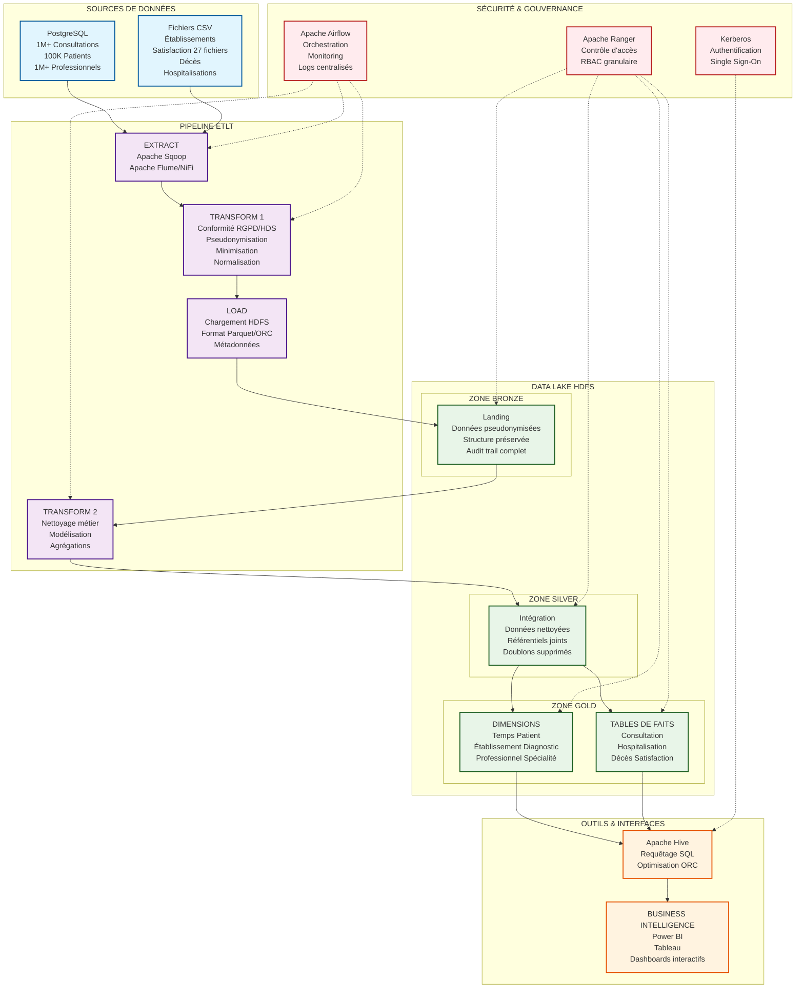

# Architecture ETLT - CHU Big Data

## Instructions d'export :
1. Copier le code Mermaid ci-dessus
2. Aller sur https://mermaid.live/
3. Coller le code
4. Ajuster la taille du diagramme (zoom)
5. Exporter en PNG haute résolution (minimum 1920px de largeur)
6. Sauvegarder sous le nom `architecture_etlt.png`

## Conseils pour un meilleur rendu :
- Utiliser le mode "PNG" plutôt que SVG pour une meilleure compatibilité
- Choisir une résolution élevée (300 DPI minimum)
- Le diagramme utilisera des couleurs et icônes pour une meilleure lisibilité