# Modèle Dimensionnel en Constellation - CHU

```mermaid
erDiagram
    %% Dimensions communes
    DIM_TEMPS {
        int sk_temps PK
        date date_complete
        int annee
        int trimestre
        int mois
        int semaine
        int jour
        varchar jour_semaine
        varchar mois_libelle
        varchar trimestre_libelle
    }
    
    DIM_PATIENT {
        int sk_patient PK
        varchar patient_pseudo_id
        varchar sexe
        int age_consultation
        int tranche_age
        varchar groupe_sanguin
        varchar ville
        varchar region
    }
    
    DIM_ETABLISSEMENT {
        int sk_etablissement PK
        varchar finess
        varchar nom_etablissement
        varchar ville
        varchar region
        varchar type_etablissement
        varchar statut
    }
    
    DIM_DIAGNOSTIC {
        int sk_diagnostic PK
        varchar code_diag
        varchar libelle_diagnostic
        varchar categorie_cim10
        varchar chapitre_cim10
        varchar gravite
    }
    
    DIM_PROFESSIONNEL {
        int sk_professionnel PK
        varchar prof_pseudo_id
        varchar profession
        varchar specialite
        varchar type_identifiant
        varchar etablissement_rattache
    }
    
    DIM_SPECIALITE {
        int sk_specialite PK
        varchar code_specialite
        varchar libelle_specialite
        varchar domaine_medical
    }
    
    DIM_MUTUELLE {
        int sk_mutuelle PK
        varchar nom_mutuelle
        varchar type_mutuelle
        varchar region_mutuelle
    }
    
    DIM_LOCALISATION {
        int sk_localisation PK
        varchar code_commune
        varchar commune
        varchar code_postal
        varchar departement
        varchar region
        varchar pays
    }
    
    DIM_TYPE_ENQUETE {
        int sk_type_enquete PK
        varchar type_enquete
        varchar annee_enquete
        varchar methodologie
        varchar periodicite
    }

    %% Tables de faits
    FAIT_CONSULTATION {
        int sk_temps FK
        int sk_patient FK
        int sk_professionnel FK
        int sk_diagnostic FK
        int sk_etablissement FK
        int sk_mutuelle FK
        int nb_consultations
        decimal duree_consultation
        decimal cout_consultation
        varchar motif_consultation
    }
    
    FAIT_HOSPITALISATION {
        int sk_temps_entree FK
        int sk_temps_sortie FK
        int sk_patient FK
        int sk_etablissement FK
        int sk_diagnostic FK
        int nb_hospitalisations
        int duree_sejour
        decimal cout_sejour
        varchar service
        varchar mode_entree
        varchar mode_sortie
    }
    
    FAIT_DECES {
        int sk_temps FK
        int sk_patient FK
        int sk_localisation FK
        int sk_diagnostic_principal FK
        int nb_deces
        int age_deces
        varchar lieu_deces
        varchar cause_deces
    }
    
    FAIT_SATISFACTION {
        int sk_temps FK
        int sk_etablissement FK
        int sk_type_enquete FK
        int nb_reponses
        decimal score_global
        decimal score_accueil
        decimal score_soins
        decimal score_chambre
        decimal score_repas
        decimal score_sortie
        varchar niveau_satisfaction
    }

    %% Relations Fait Consultation
    DIM_TEMPS ||--o{ FAIT_CONSULTATION : "periode"
    DIM_PATIENT ||--o{ FAIT_CONSULTATION : "patient"
    DIM_PROFESSIONNEL ||--o{ FAIT_CONSULTATION : "professionnel"
    DIM_DIAGNOSTIC ||--o{ FAIT_CONSULTATION : "diagnostic"
    DIM_ETABLISSEMENT ||--o{ FAIT_CONSULTATION : "etablissement"
    DIM_MUTUELLE ||--o{ FAIT_CONSULTATION : "mutuelle"
    
    %% Relations Fait Hospitalisation
    DIM_TEMPS ||--o{ FAIT_HOSPITALISATION : "temps_entree"
    DIM_PATIENT ||--o{ FAIT_HOSPITALISATION : "patient"
    DIM_ETABLISSEMENT ||--o{ FAIT_HOSPITALISATION : "etablissement"
    DIM_DIAGNOSTIC ||--o{ FAIT_HOSPITALISATION : "diagnostic"
    
    %% Relations Fait Décès
    DIM_TEMPS ||--o{ FAIT_DECES : "temps"
    DIM_PATIENT ||--o{ FAIT_DECES : "patient"
    DIM_LOCALISATION ||--o{ FAIT_DECES : "localisation"
    DIM_DIAGNOSTIC ||--o{ FAIT_DECES : "diagnostic"
    
    %% Relations Fait Satisfaction
    DIM_TEMPS ||--o{ FAIT_SATISFACTION : "temps"
    DIM_ETABLISSEMENT ||--o{ FAIT_SATISFACTION : "etablissement"
    DIM_TYPE_ENQUETE ||--o{ FAIT_SATISFACTION : "enquete"
```

## Description du modèle :

### **Dimensions communes :**
- **DIM_TEMPS** : Calendrier complet avec hiérarchies temporelles
- **DIM_PATIENT** : Patients pseudonymisés avec démographie
- **DIM_ETABLISSEMENT** : Établissements de santé avec géolocalisation
- **DIM_DIAGNOSTIC** : Classification CIM-10 avec hiérarchies

### **Dimensions spécifiques :**
- **DIM_PROFESSIONNEL** : Professionnels de santé (pour consultations)
- **DIM_LOCALISATION** : Géographie (pour décès)
- **DIM_TYPE_ENQUETE** : Types d'enquêtes (pour satisfaction)

### **Tables de faits :**
- **FAIT_CONSULTATION** : Activité de consultation
- **FAIT_HOSPITALISATION** : Séjours hospitaliers
- **FAIT_DECES** : Mortalité
- **FAIT_SATISFACTION** : Enquêtes de satisfaction

### **Modèle constellation justifié :**
4 processus métier distincts partageant des dimensions communes (Temps, Patient, Établissement, Diagnostic) mais ayant chacun leurs dimensions spécifiques.