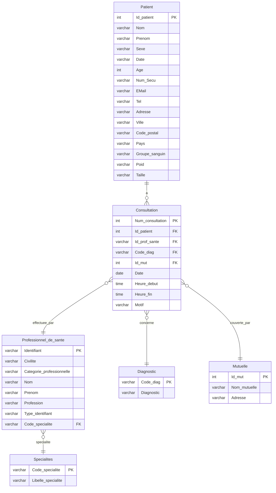

# Schéma UML des données PostgreSQL - CHU

## Instructions d'export :
1. Copier le code Mermaid ci-dessus
2. Aller sur https://mermaid.live/
3. Coller le code
4. Ajuster la taille si nécessaire
5. Exporter en PNG (haute résolution) ou SVG
6. Sauvegarder sous le nom `uml_postgresql.png`