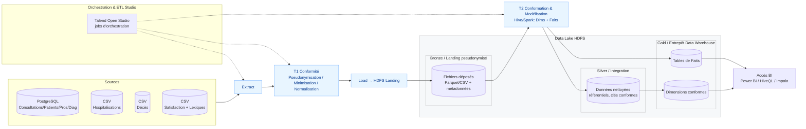

```mermaid
flowchart LR
  %% SOURCES
  subgraph SRC["Sources"]
    PSQL[("PostgreSQL<br/>Consultations/Patients/Pros/Diag")]
    CSVH[("CSV<br/>Hospitalisations")]
    CSVD[("CSV<br/>Décès")]
    CSVS[("CSV<br/>Satisfaction + Lexiques")]
  end

  %% ETL STEPS
  E["Extract"]
  T1["T1 Conformité<br/>Pseudonymisation / Minimisation / Normalisation"]
  L["Load → HDFS Landing"]
  T2["T2 Conformation & Modélisation<br/>Hive/Spark: Dims + Faits"]

  %% DATA LAKE ZONES
  subgraph LAKE["Data Lake HDFS"]
    subgraph BRONZE["Bronze / Landing pseudonymisé"]
      RAW[("Fichiers déposés<br/>Parquet/CSV + métadonnées")]
    end
    subgraph SILVER["Silver / Integration"]
      CLEAN[("Données nettoyées<br/>référentiels, clés conformes")]
    end
    subgraph GOLD["Gold / Entrepôt Data Warehouse"]
      DIMS[("Dimensions conformes")]
      FACTS[("Tables de Faits")]
    end
  end

  %% BI LAYER
  BI["Accès BI<br/>Power BI / HiveQL / Impala"]

  %% TOOLING SIDE
  subgraph TOOL["Orchestration & ETL Studio"]
    TAL["Talend Open Studio<br/>jobs d'orchestration"]
  end

  %% FLOWS
  SRC --> E --> T1 --> L
  L --> RAW
  RAW --> T2
  T2 --> CLEAN --> DIMS
  T2 --> FACTS

  %% OUTPUT
  DIMS --> BI
  FACTS --> BI

  %% STYLING
  classDef zone fill:#f6f8fa,stroke:#b3b3b3,color:#222
  classDef step fill:#e8f5ff,stroke:#6aa9ff,color:#0b3d91,stroke-width:1px
  class BRONZE,SILVER,GOLD,LAKE zone
  class E,T1,L,T2 step

  %% TOOL LINKS
  TAL -.-> E
  TAL -.-> T1
  TAL -.-> T2
```